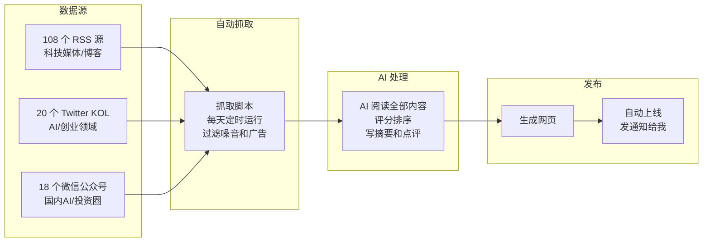
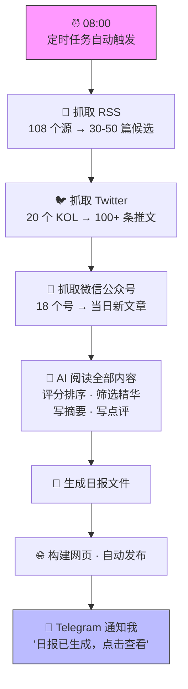

# 我不会写代码，但我做了一个每天自动运行的新闻网站

> 从第一行代码到上线，不到 48 小时。我写的代码：0 行。

**先看成品** → [小虾AI日报](https://justin7974.github.io/Daily-News/)

---

## 它是什么

**小虾AI日报**是一个全自动的科技新闻聚合服务。每天早上 8 点，它自己完成以下所有事情：

1. 从 **108 个 RSS 源**抓取最新文章（覆盖硅谷科技博客、中文科技媒体、AI 研究、安全等领域）
2. 从 **20 个 Twitter KOL** 账号抓取推文（覆盖 AI 研究、创业、产品等方向）
3. 从 **18 个微信公众号**获取最新内容（覆盖国内 AI、投资、深度分析）
4. AI 阅读所有内容，评分筛选，精选约 30 篇
5. 为每篇文章写中文摘要，精选文章附上投资人视角的点评（比如：竞争壁垒在哪、对赛道意味着什么、创始人信号）
6. 自动构建网页，发布上线
7. 给我发一条 Telegram 通知，附上链接

全程**无人值守**。我只需要偶尔看看效果，觉得哪里不好就告诉 AI 去改。

---

## 系统全景

---

## 它是怎么做出来的

整个过程分两个阶段。我全程没有写过一行代码，也没有手动写过一篇日报。但我花了大量时间在研究、测试和优化上——这个过程本身也是学习和乐趣的一部分。

### Phase 1：先跑起来（2月初）

起因很简单：我想每天早上收到一份科技行业日报，不想再手动刷各种信息源了。

最开始 AI 并没有现成的信源方案——它只会用搜索引擎临时去找文章，效果很不稳定：有时候找到的是几天前的旧闻，有时候是跟科技无关的内容。

转折点是**我翻出了自己多年积累的精选信源**：长期关注的科技博客、RSS 订阅列表、Twitter 上值得跟的人。这些是我作为投资人十几年信息判断力的积累，AI 没有这个——它能执行，但不知道该关注谁。

我把信源给了 AI，它搭建了抓取逻辑和定时任务：

- 配置了 RSS 订阅源（从我给的列表出发，逐步扩展）
- 配置了 Twitter KOL 的自动抓取
- 设置了每天早 8 点自动运行的定时任务
- 每天生成一份结构化的日报，按频道分类，自动发到我的 Telegram

从 2 月 1 日起，这个管道就开始每天自动跑了。这个阶段基本靠 AI 自己搞定，我只管提信源、看结果。**先跑起来再说。**

### Phase 2：认真打磨 + 做成网站（2月中旬）

跑了两周后，我开始认真审视每个环节的质量——这才是真正花时间的阶段。我一个个环节去研究、测试、发现问题、提改进，AI 负责执行。这个过程就像带一个执行力极强但需要你给方向的新人。

**深入优化抓取和内容质量：**

- **信源审查**：逐个看每个 RSS 源的实际产出，发现有些源几乎不出有用的内容，有些源每天出十几篇但大部分是水文。把信源分了优先级（必读、重要、补充），让 AI 按优先级分配注意力
- **时间窗口**：最初用"过去 24 小时"，发现如果定时任务延迟了，窗口就会偏移，导致漏文章或者重复。改成固定的每天 08:00 到次日 08:00，问题解决
- **Twitter 数据**：这是最折腾的部分。Twitter 的非官方抓取经常失败——研究了好几天，从 cookie 怎么获取、怎么保持有效、到抓取并发度怎么控制，才稳定下来。一度有 50% 的天数 Twitter 数据是空的
- **架构升级**：发现 AI 每天临时写抓取代码很不稳定（有时候写对了有时候没有），我提出把确定性的工作（抓数据）交给预先写好的脚本，AI 只做需要判断力的工作（评分、筛选、写摘要）。这一改效率和稳定性都上了一个台阶
- **内容质量标准**：写了一份详细的"质量规范"，告诉 AI 什么样的文章该选、点评怎么写才有深度（不能只是重复摘要，要有投资判断——竞争格局、第二层效应、"So What"）。这份规范前后改了好几版
- **信源持续扩展**：从最初几十个逐步扩展到 108 个 RSS + 20 个 Twitter KOL，后来又加了 18 个微信公众号

自己反复测试跑了很多次，每次都要看结果、跟前一天对比、发现新问题。这个过程不是"说一句话就搞定"，而是**不断学习、测试、调整**的循环。但也正因为如此，学到了很多东西，越来越熟练。

**同时把日报做成网站（< 48 小时）：**

我觉得 Telegram 里看日报不够方便——没有历史归档，排版也有限，更不方便分享给别人。于是我跟 AI 说：

> "帮我把日报做成一个网站，要好看，能翻历史，能在手机上看。"

AI 在 2/15 深夜到 2/17 晚上，不到 48 小时内完成了所有事情：

- **教我上手 Git 和 GitHub**：我以前接触过但很不熟悉，AI 手把手带我走了一遍完整流程（创建仓库、提交代码、推送上线）
- **搭建了网站生成器**：把每天的日报 Markdown 文件自动转成 HTML 网页，无需手动操作
- **设计了网站样式**：参考 Stratechery 和 Lenny's Newsletter 的暖色调 clean 风格，720px 窄栏阅读体验，橙色强调色
- **做了交互功能**：日历选择器（跳转到任意日期）、暗色模式切换、前后日期翻页导航
- **回填历史内容**：把 2/1 到 2/16 的 16 天日报全部灌入网站，一次性有了完整归档
- **部署上线**：配置 GitHub Pages，推送即发布，自动获得 HTTPS
- **部署微信公众号抓取**：跑了一个 Docker 容器，连接微信公众平台（我只需要扫一次码授权），18 个公众号的内容自动入库
- **三频道整合**：网站上加了 Tab 切换（RSS / Twitter / 公众号），把微信频道接入每日自动化流程，三个数据源全部打通

**最终成果：** 一个每天自动更新的三频道新闻网站，18 期历史日报归档，支持手机浏览，暗色模式，日历导航。

**一个感受：** 整个过程最大的乐趣不是"说一句话然后等结果"，而是不断学习新东西、不断 vibe coding（跟 AI 一起边探索边做）的过程。一开始我连 Git 都不太会用，到后来能自己判断"这个架构不对，应该改成脚本做确定性工作、AI 只做判断"——这种成长感很真实。熟能生巧，越用越知道怎么提需求，AI 的输出质量也就越高。

---

## 我做了什么 vs AI 做了什么

| 我做的 | AI 做的 |
|--------|---------|
| 定义需求："我要一个每天自动跑的日报" | 写了全部代码（~1900 行 Python/JS/HTML/CSS） |
| 提供信源：从自己积累的列表中选 RSS 源、KOL、公众号 | 写了 3 个数据抓取脚本（RSS、Twitter、微信） |
| 定质量标准：什么算好文章、点评该有什么深度 | 搭建了静态网站生成器（Markdown → HTML） |
| 研究和测试：反复跑测试、对比结果、定位问题 | 设计了整套网页样式（暖色调、响应式、暗色模式） |
| 审核质量：每天看效果，发现不对的地方 | 配置了自动化定时任务（每天 8 点无人值守运行） |
| 提反馈："这不对"、"改一下"、"换个方案" | 部署了微信抓取系统（Docker 容器 + 数据库） |
| 扫了一次微信码（授权公众号抓取） | 调试了所有 bug，修复了所有问题 |
| 决定架构方向（脚本做抓取，AI 只做判断） | 完整执行了我定的架构方向 |

一句话总结：**我是产品经理，AI 是我的全栈工程师团队。**

我提供的是判断力——该做什么、什么算好、什么时候该换方向。AI 提供的是执行力——写代码、调 bug、部署上线，速度极快且不知疲倦。

---

## 有意思的小故事

### "日历选择器改了 3 版"

我让 AI 给网站加一个日历，方便跳转到任意日期的日报。

**第一版**：做了个内嵌在页面里的小组件——不好看，跟页面风格不搭。我说"改"。

**第二版**：做了个下拉菜单放在 header 里——被父容器裁切了，展开后被挡住点不到。我说"这不对啊大哥"。

**第三版**：做了个全屏浮层从顶部滑下来，点日历图标弹出，点日期直接跳转——终于满意。

整个过程我只需要说"不对"两个字，AI 每次都立刻推翻重来，不抱怨、不解释、直接给新方案。三轮迭代大概花了 20 分钟。如果是跟人类工程师这样沟通，可能每次都要开个会讨论为什么不行、下次怎么改。

### "发现 AI 用的模型在编造 Twitter 数据"

我拿到两周的日报做质量审查时，发现一个严重问题：有个 AI 模型（Kimi）在 5 天的日报里编造了 Twitter 推文——链接打不开，内容是虚构的，甚至引用了我信源列表里根本不存在的 KOL 账号。

解决方法很简单：换成另一个模型（MiniMax），同样的数据源和提示词，编造问题立刻消失。然后我让 AI 用 MiniMax 重跑了所有历史日报。

**教训**：AI 不是完美的，不同模型的"诚实度"差异很大。但你只需要知道怎么判断结果好不好——发现问题 → 换方案 → 解决。这跟管人其实是一样的：你不需要自己能写代码，你需要能判断交付质量。

### "AI 的工作日志说文件创建了，但文件不存在"

有一天我检查自动化系统，发现两个关键的抓取脚本文件不存在——但 AI 的工作日志里清清楚楚地写着"已创建 fetch_rss_v2.py 和 fetch_twitter.py"。等于 AI 自己觉得做了，但实际上没落盘。

这导致每天的定时任务跑到抓取这一步就报错，一直靠 AI 临时写代码顶着。后来另一个 AI（Claude Code）检查出了这个问题，几分钟就重新创建了这些文件。

**教训**：AI 也会出 bug，和人类程序员一样。但区别是：人类可能要花几小时排查定位，AI 从发现到修复可能就 5 分钟。关键是你要有验证习惯——不能光看日志说"搞定了"就信了，要实际去检查结果。

---

## 数字

| 指标 | 数值 |
|------|------|
| RSS 订阅源 | 108 个（覆盖英文科技、中文科技、AI 研究、安全等） |
| Twitter KOL | 20 个（AI 前沿、创业、产品、提示工程等） |
| 微信公众号 | 18 个（AI 深度分析、投资、行业观察等） |
| 每天处理的原始文章 | 100+ 篇 |
| 每天精选输出 | ~30 篇（含摘要和点评） |
| 代码总量 | ~1900 行（Python + JavaScript + HTML/CSS） |
| 我写的代码 | 0 行 |
| 网站搭建时间 | < 48 小时（从第一个 commit 到三频道全自动化上线） |
| 每天自动执行耗时 | ~4 分钟（从触发到网页发布完成） |
| 日报连续运行 | 18 天+（2/1 至今，未中断） |

---

## 每天早上发生了什么

从触发到我收到通知，大约 4 分钟。我什么都不用做。

如果某个环节出了问题（比如 Twitter 的 cookie 过期了），AI 会在 Telegram 通知里告诉我哪里出错，我再去处理。大部分时候，它就安静地每天跑着。

---

## 对我们的启示

**1. Non-coder → Builder 的门槛已经消失了。**

我不会 Python、不会 JavaScript、不会 HTML，但我做出了一个完整的、每天自动运行的新闻服务。它不是一个一次性的 demo——它已经连续运行了两周多，每天稳定产出。以前做这种事情，你至少需要一个全栈工程师干一两个月。

**2. AI 是放大器，不是替代品。**

AI 写了全部 1900 行代码，但它不知道应该关注哪些 RSS 源、什么样的点评才对投资人有价值、日报的目标读者是谁、什么时候应该换模型。判断力仍然是人的，而且可能是最重要的东西。AI 提供的是执行力的极致放大——以前需要一个 3-5 人小团队搭建和维护的服务，现在一个人加 AI 就够了。

**3. 关键不是技术能力，是提需求的能力和学习意愿。**

整个过程中我做的最重要的事情：清楚地描述我要什么、判断结果好不好、知道什么时候说"不对，重来"。这些能力，恰好是投资人每天都在练的——我们判断项目不就是这样吗？看到一个东西，快速判断好不好，不好的话问题在哪、怎么改。

同时，愿意花时间去学习和研究也很关键。不是"丢给 AI 一句话就完事"——我花了大量时间研究每个环节、测试不同方案、理解为什么这样做更好。这个过程本身就是 vibe coding 的乐趣所在。

**4. 想象一下。**

如果每个投资人都能这样，用 AI 搭建自己定制的信息管道——不再依赖公共媒体的议程设置，而是按照自己的投资逻辑去筛选和理解信息——会怎样？

更进一步：如果这种能力不局限于信息获取呢？投后管理的自动化追踪、Deal Flow 的智能筛选、竞品分析的定期更新……每个投资人身边都有一个不知疲倦的 AI 团队，你只需要提供判断力。

这个未来不远。我用两周业余时间就走到了这一步。

---

*Built by 小虾的主人[小渣](mailto:justinlee7974@gmail.com)*
*2026 年 2 月*
